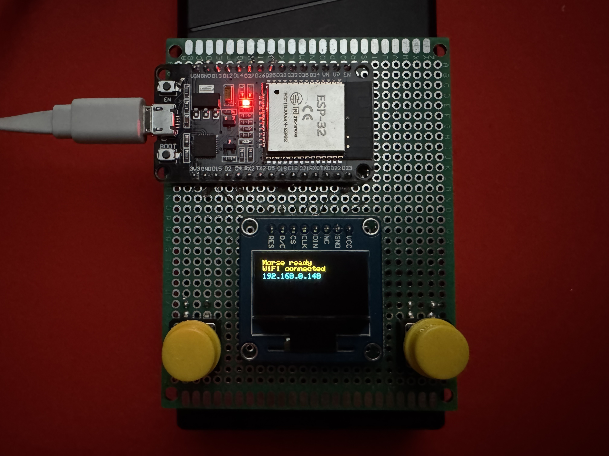
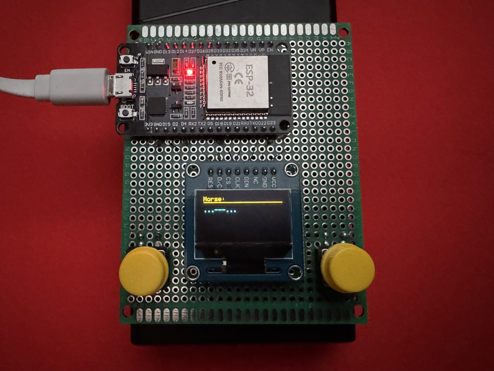
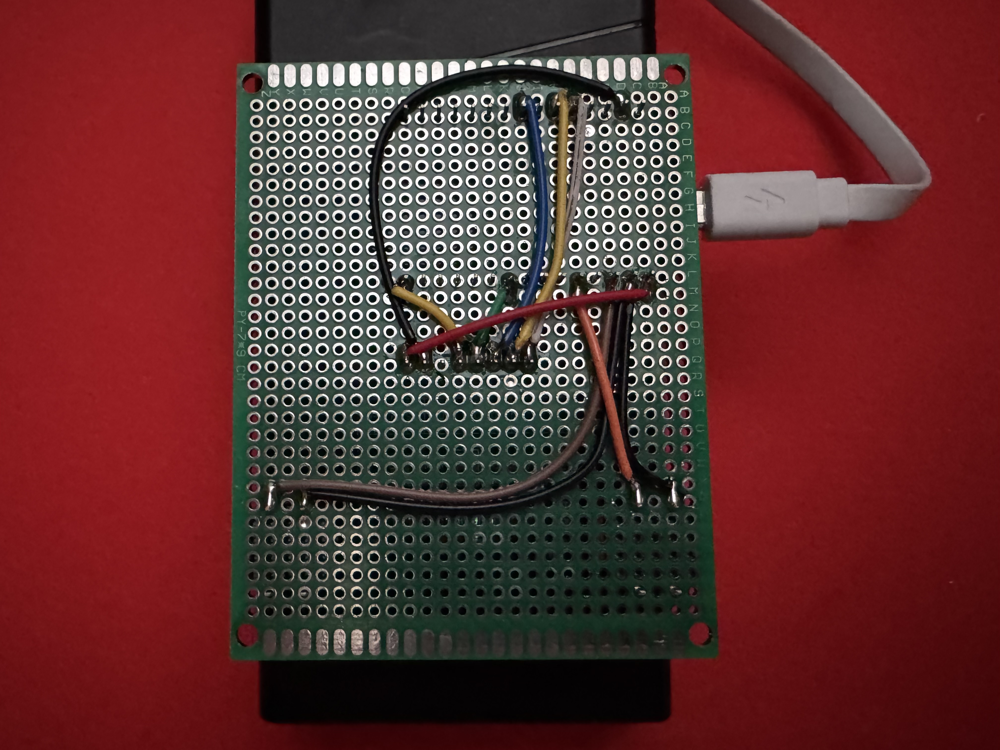

# Morse Sender – ESP32 Morse Code Transmitter

This project is a simple Morse code input device built with an ESP32, an OLED screen, and two buttons. It lets you tap Morse code using a physical button, display the input on the screen, and send the encoded message to a local server or discord.

## Pinout & Connections

| Component         | Function           | ESP32 GPIO | ESP32 Label (Printed on Board) |
|------------------|--------------------|------------|--------------------------------|
| **OLED (SPI)**   | VCC                | 3.3V       | 3V3                            |
|                  | GND                | GND        | GND                            |
|                  | DIN (MOSI)         | GPIO 23    | D23                            |
|                  | CLK (SCK)          | GPIO 18    | D18                            |
|                  | CS (Chip Select)   | GPIO 25     | D25                           |
|                  | DC (Data/Command)  | GPIO 27    | D27                            |
|                  | RES (Reset)        | GPIO 14    | D14                            |
| **Button 1**     | Morse input        | GPIO 4     | D4                             |
| **Button 2**     | Send / Clear       | GPIO 15    | D15                            |

*Note: Buttons are connected between the GPIO pin and GND. Internal pull-up resistors are used in code*

## Environment Setup

```text
WIFI_SSID=your_wifi_ssid
WIFI_PASS=your_wifi_password
SERVER_URL=http://your_server_url/morse
DISCORD_WEBHOOK_URL=https://discord.com/api/webhooks/your_webhook_id/your_webhook_token
```

## Images






